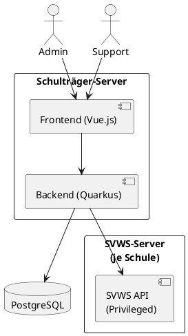
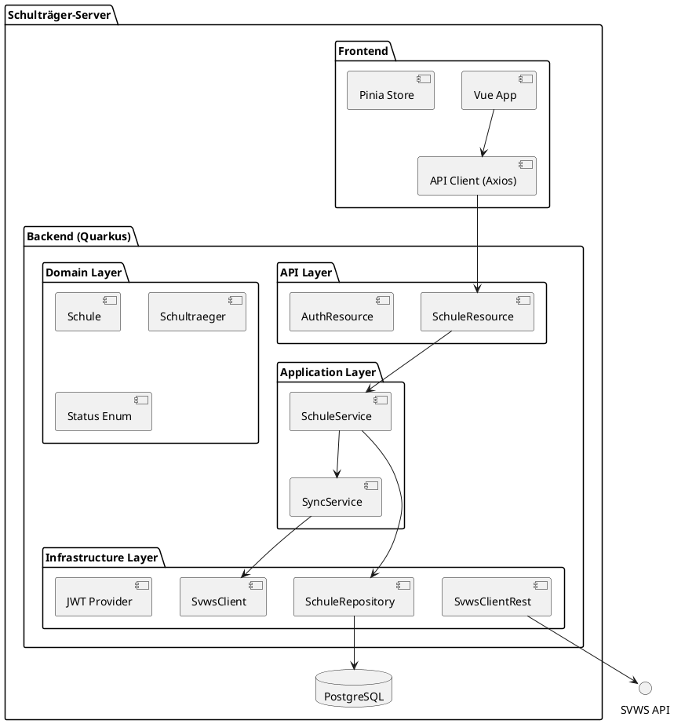
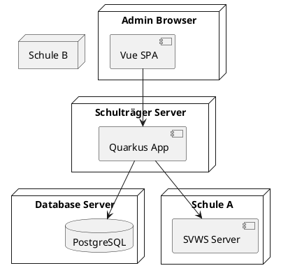
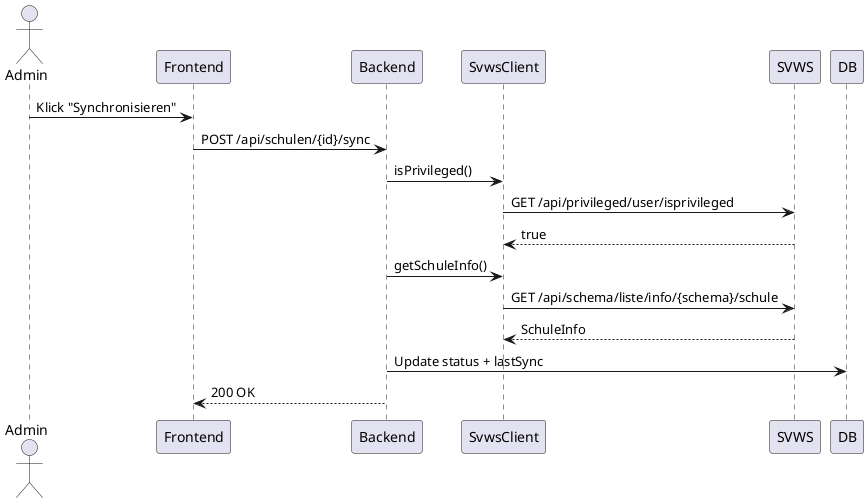

---

# 1️⃣ Systemkontext (arc42 Abschnitt 3 – Kontextabgrenzung)

## Ziel

Zeigt, wie sich der Schulträger-Server in die Umgebung einbettet.



---

# 2️⃣ Bausteinsicht – Container-Level (arc42 Abschnitt 5)

## Container-Übersicht



---

# 3️⃣ Verteilungssicht (arc42 Abschnitt 7)

Zeigt physische Knoten.



Später erweiterbar um:

* Keycloak Server
* Monitoring Stack
* Reverse Proxy
* Scheduler Node

---

# 4️⃣ Laufzeitsicht – Synchronisation (arc42 Abschnitt 6)

Beispiel: Sync einer Schule



---

# 5️⃣ Vorbereitung für arc42 Dokumentation

Empfohlene Struktur:

```text
1. Einführung und Ziele
2. Randbedingungen
3. Kontextabgrenzung
4. Lösungsstrategie
5. Bausteinsicht
6. Laufzeitsicht
7. Verteilungssicht
8. Querschnittliche Konzepte
9. Architekturentscheidungen (ADR)
10. Qualitätsanforderungen
11. Risiken
12. Glossar
```

---

# 6️⃣ Wichtige Architekturprinzipien für arc42 Abschnitt 4

Formuliere dort:

* Clean Architecture
* Hexagonale Architektur
* Ports & Adapters
* Mandantenfähigkeit vorbereitend
* API-first Integration mit SVWS
* RESTful Backend
* Stateless Backend
* Security-by-Design

---

# 7️⃣ Qualitätsziele (für arc42 Abschnitt 10)

Priorität:

1. Wartbarkeit
2. Erweiterbarkeit
3. Sicherheit
4. Ausfallsicherheit bei SVWS-Problemen
5. Nachvollziehbarkeit von Sync-Prozessen

---

# 🔥 Optional – C4 Modell

Wenn ihr professionell dokumentieren wollt, empfehle ich:

* C4 Level 1 = Kontext
* C4 Level 2 = Container
* C4 Level 3 = Komponenten
* C4 Level 4 = Code

arc42 + C4 kombiniert ist Best Practice.

---

