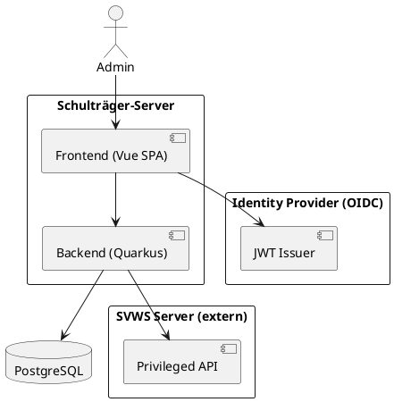
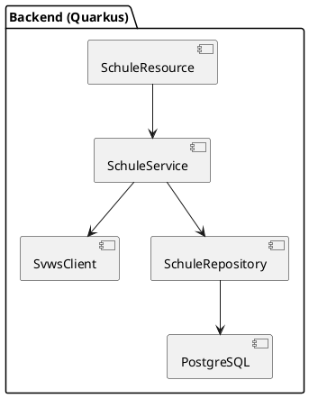
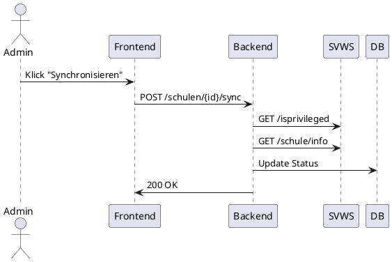
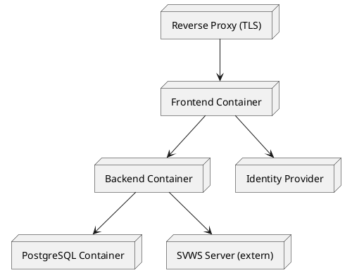

---

# 📘 arc42 – Architektur­dokumentation

# Schulträger-Server (MVP)

**Version:** 1.0 (MVP)
**Stand:** 14.02.2026
**Status:** In Umsetzung

---

# 1. Einführung und Ziele

## 1.1 Aufgabenstellung

Der Schulträger-Server ist eine mandantenfähige Verwaltungsplattform für Schulträger.

Im MVP ermöglicht das System:

* Verwaltung von Schulen eines Schulträgers
* Anbindung externer SVWS-Server
* Prüfung privilegierter API-Zugänge
* Manuelle Synchronisation von Schulinformationen
* Anzeige von Status und Fehlerzuständen

Das System wird als containerisierte Webanwendung betrieben.

---

## 1.2 Qualitätsziele (priorisiert)

| Priorität | Qualitätsziel       | Beschreibung                              |
| --------- | ------------------- | ----------------------------------------- |
| 1         | Wartbarkeit         | Klare Schichten, erweiterbare Architektur |
| 2         | Sicherheit          | Mandantenisolation, JWT-basierte Auth     |
| 3         | Erweiterbarkeit     | Vorbereitung für weitere Rollen & Module  |
| 4         | Nachvollziehbarkeit | Strukturiertes Logging                    |
| 5         | Cloud-Fähigkeit     | Container-basiertes Deployment            |

---

# 2. Randbedingungen

## Technische Randbedingungen

* Backend: Quarkus
* Frontend: Vue.js (SPA)
* Datenbank: PostgreSQL
* Authentifizierung: OIDC / JWT
* Deployment: Docker Compose
* Reverse Proxy mit TLS

## Organisatorische Randbedingungen

* MVP-Fokus
* Nur Rolle `ADMIN`
* Keine Hochverfügbarkeit im MVP
* Pilotbetrieb vorgesehen

---

# 3. Kontextabgrenzung

## 3.1 Fachlicher Kontext

**Akteure:**

* Administrator (ADMIN)
* Externe SVWS-Server
* Identity Provider (OIDC)

## Systemkontextdiagramm



---

# 4. Lösungsstrategie

## Architekturprinzipien

* Hexagonale Architektur (Ports & Adapters)
* Klare Layer-Trennung
* Stateless Backend
* JWT-basierte Security
* Mandantenfähigkeit (Tenant-ID)
* Container-basierter Betrieb
* Erweiterbar ohne Re-Architektur

## MVP-Fokus

* Synchrone SVWS-Kommunikation
* Manuelle Synchronisation
* Kein Messaging-System
* Kein Event-Driven Design
* Keine Multi-Instanz-Skalierung

---

# 5. Bausteinsicht

## 5.1 Backend-Struktur

```
api/
application/
domain/
infrastructure/
```

### Layer-Verantwortung

| Layer          | Aufgabe                   |
| -------------- | ------------------------- |
| API            | REST Endpunkte            |
| Application    | Use Cases                 |
| Domain         | Geschäftslogik            |
| Infrastructure | DB, SVWS-Client, Security |

---

## 5.2 Hauptkomponenten



---

# 6. Laufzeitsicht

## 6.1 Schule synchronisieren (MVP)



---

# 7. Verteilungssicht

## Deployment-Übersicht



---

# 8. Querschnittliche Konzepte

## 8.1 Security

* OIDC
* JWT Access Tokens
* tenant_id im Claim
* Rollenbasiert (ADMIN)
* Stateless Backend

---

## 8.2 Multi-Tenancy

* Mandant = Schulträger
* tenant_id pro Tabelle
* Tenant wird aus JWT gelesen
* Keine Mandanten-ID aus Request

---

## 8.3 Persistenz

* PostgreSQL
* Flyway Migrationen
* tenant_id in jeder Tabelle
* Verschlüsselte Speicherung von SVWS-Credentials

---

## 8.4 Logging

* JSON Logging
* tenant_id im Log
* request_id
* SVWS-Aufrufe protokolliert
* Health-Endpoints

---

# 9. Architekturentscheidungen (ADR-Übersicht)

| ADR     | Thema                  |
| ------- | ---------------------- |
| ADR-001 | Hexagonale Architektur |
| ADR-002 | Persistenzstrategie    |
| ADR-003 | Authentifizierung      |
| ADR-004 | Multi-Tenancy          |
| ADR-005 | SVWS-Integration MVP   |
| ADR-006 | Logging & Monitoring   |
| ADR-007 | Deployment             |

---

# 10. Qualitätsanforderungen

| Kategorie       | Bewertung |
| --------------- | --------- |
| Wartbarkeit     | Hoch      |
| Sicherheit      | Hoch      |
| Erweiterbarkeit | Hoch      |
| Skalierbarkeit  | Mittel    |
| Resilienz       | Mittel    |
| Betriebsreife   | Mittel    |
| Performance     | Hoch      |

---

# 11. Risiken

| Risiko                    | Gegenmaßnahme          |
| ------------------------- | ---------------------- |
| SVWS nicht erreichbar     | Statusmodell + Logging |
| Mandantenfilter vergessen | Code Review + Tests    |
| Single Point of Failure   | Backup-Strategie       |
| Fehlkonfiguration OIDC    | Konfigurationsprüfung  |

---

# 12. Glossar

| Begriff | Bedeutung                       |
| ------- | ------------------------------- |
| Mandant | Schulträger                     |
| SVWS    | Externer Schulverwaltungsserver |
| OIDC    | OpenID Connect                  |
| JWT     | JSON Web Token                  |
| MVP     | Minimal Viable Product          |

---

# 🎯 Ergebnis

Mit diesem arc42-Dokument:

* Ist die Architektur vollständig dokumentiert
* Sind alle ADRs integriert
* Ist der MVP klar abgegrenzt
* Ist die Grundlage für Weiterentwicklung gelegt
* Ist das System auditierbar

---
